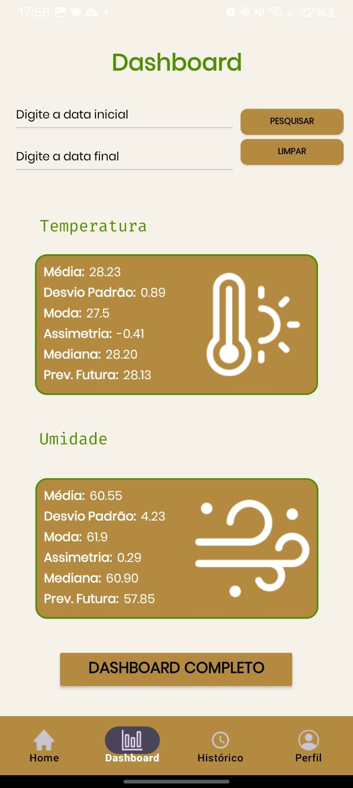

# Mobile - Agro Guard
### Aplicação cujo objetivo é auxiliar os produtores na sua plantação, disponibilizando dados da temperatura e umidade.

## Objetivo

 Esse repositório concentra todas as informações do desenvolvimento da versão mobile do projeto. 

## Tecnologia

Aplicativo criado utilizando Java para Android

 
 - Java 
 - Hilt / Dagger 
 - MVVM 
- Injeção de dependências

## Serviços

O aplicativo é baseado no sistema de criação de usuários com validação de token.

Na tela inicial, é possível consultar o último dado coletado de temperatura e umidade

Possui um dashboard que traz alguns dados estatísticos  e que leva para o dashboard completo.

Consultar histórico de medições e alteração de senha do usuário.

## Imagens

## Download da aplicação
<a href="https://drive.google.com/file/d/1pYDVrEt-J64ywBC7zPIVk_wnCveZCD07/view?usp=drive_link">Baixe o Apk V1</a> 
<a href="https://drive.google.com/file/d/1v9wiIhUhdbtVNbsNEmsdcDvnIbL47f8o/view?usp=drive_link">Baixe o Apk V2</a> 

## Desenvolvido

Todo o projeto foi desenvolvido pelos alunos:  

Cayk Andrade Magnani, Guilherme de Carvalho Ferreira e  Lucas Gean dos Santos.
 
